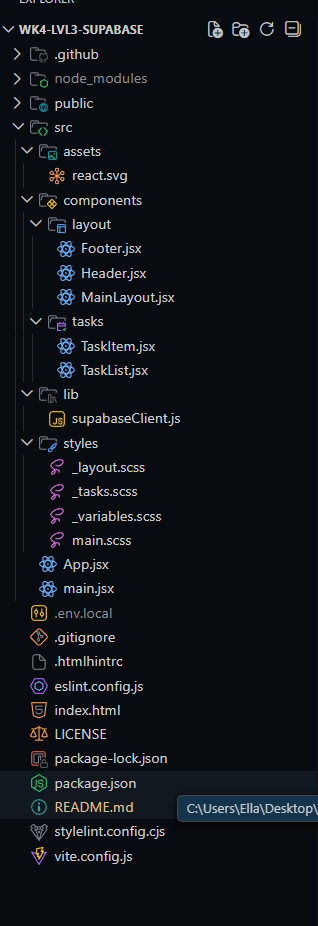

# wk4-lvl3-supabase

This is the repo for the Week 4, Level 3 assignments with CodeX for learning about supabase.

## Project Structure



## **Tech Stack**

This is what the project is using right now:

* **React (Vite)** — base framework for the app
* **Supabase** — backend database + authentication + API layer
* **Sass (SCSS)** — styling and partials
* **Axios** — for making HTTP requests (will be used later)
* **React Router DOM** — for routing once we start adding pages
* **ESLint / Stylelint / HTMLHint** — linting and code quality tools
* **GitHub Workflows** — automated lint checks
* **Node + npm** — project tooling and package management

## Day 1 — React + Supabase Project Setup (Read Functionality)

### Objective

Today I set up base for this week’s project up. Most of today was just wiring things up to match the repo Ulises walked us through in class, such as installing everything, setting up Supabase, organizing the project structure, getting the layout components in place, and making sure the environment was ready before we start actually querying anything.

### What I Did Today

1. **Set up my Supabase account and created the project for this app.**

   * Created a new Supabase project
   * Added a `tasks` table and set the initial schema:

| Column      | Type      | Default         |
|-------------|-----------|-----------------|
| id          | int8      | ---             |
| created_at  | timestamp | now()           |
| title       | text      | 'Example Title' |
| is_complete | bool      | false           |

* Enabled Row Level Security (RLS) on the table
* No policies added yet — this is just the initial setup

2. **Initialized npm and installed the main dependencies for the project.**

* Ran `npm init -y` to initialize npm for the project
* Then installed depdencies
* `npm install`
* `npm install @supabase/supabase-js` to install the js client library for supabase
* `npm install sass axios react-router-dom` to set up sass, axios and the react router dom for the project

3. Installed the linters.
   npm install --save-dev eslint stylelint stylelint-config-standard-scss htmlhint
4. Copied over the following folders and files from the last project:

* .htmlhintrc
* eslint.config.js
* .stylelint.config.cjs
* .github folder with linters.yml in the workflows
* assets folder with react.svg
* public folder with vite.svg

5. **Updated the Stylelint configuration.**

Added rules so SCSS wouldn’t complain about rgba() or numeric opacity values:

```
{
"color-function-notation": "legacy",
"alpha-value-notation": "number",
}
```

6. **Created the `.env.local` file for Supabase.**

Added the URL and anon key from my personal Supabase project (not the example values from class).

```
VITE_SUPABASE_URL=your-url-here
VITE_SUPABASE_ANON_KEY=your-key-here
```

Also set up gitignore so it won't ever commit this file. This keeps the Supsabase project URL and anon key out of the repo. This is a good practice for the future as it helps ensure security isn't compromised if someone were to look at the repo/code in github.

7. **Created the Supabase client file.**

Built `supabaseClient.js` following the repo structure.

It loads env variables, checks for missing values, and creates a single Supabase client instance that will be used later in the project.

8. **Set up the basic folder structure and layout components.**

* `main.jsx` wired up React and global styles
* `App.jsx` wraps everything in the main layout
* Added `Header`, `Footer`, and `MainLayout` to establish the structure

  This part was mostly just matching the repo so the children prop works correctly.

9. **Added initial SCSS structure.**

Created the base partials (`_layout.scss`, `_tasks.scss`, `_variables.scss`) and made sure everything compiled without issues.

10. **Added TaskList and TaskItem components**

Created the basic task components that will be used later for CRUD functionality.

Right now they are just scaffolded and wired into the structure so the project compiles cleanly, and they match the folder layout we’re using for the rest of the week.

### Files Created / Updated (Day 1)

**Project Setup Files**

* `.env.local`
* `.gitignore`
* `index.html`
* `package.json`
* `stylelint.config.cjs` (updated rules)

**Source Files (`/src`)**

* `main.jsx`
* `App.jsx`

**Supabase**

* `src/lib/supabaseClient.js`

**Layout Components (`/src/components/layout`)**

* `Header.jsx`
* `Footer.jsx`
* `MainLayout.jsx`

**Task Components**

* `src/components/tasks/TaskItem.jsx`
* `src/components/tasks/TaskList.jsx`

**Styles (`/src/styles`)**

* `main.scss`
* `_layout.scss`
* `_tasks.scss`
* `_variables.scss`

**Assets**

* `src/assets/react.svg`

## Day 2–3 — Task CRUD, State Management, and Styling Updates

### Objective

Days 2 and 3 was all about taking the basic task scaffolding from Day 1 and turning it into something that actually works. We wired up the code for full CRUD behavior, pushed more logic into the states, and cleaned up the task UI so it matches how the components evolved.

Most of this work was expanding what already existed rather than adding brand-new files.

### What I Worked On

1. **Expanded `TaskList` into the main controller for tasks**

`TaskList` is now doing the heavy lifting for task behavior:

* Fetches tasks from Supabase when the component mounts
* Stores tasks in React state
* Handles create, update, and delete actions
* Passes callbacks down to child components instead of letting them talk to Supabase directly

This keeps all database logic in one place and makes the child components much simpler.

2. **Added task creation with `NewTaskForm`**

Created a new `NewTaskForm` component to handle adding tasks.

* Uses local state for:
  * input value
  * submitting/loading state
  * form-level errors
* Validates input before submitting:
  * trims whitespace
  * prevents empty titles
  * enforces a max character length
* Calls a parent callback (`onAddTask`) instead of inserting directly into Supabase

The actual insert happens in `TaskList`, which then immediately updates state by prepending the new task. Because Supabase returns the inserted row, we immediately update local state. Since the React useState drives the UI, there’s no need to refetch the entire list.

3. **Implemented task completion toggling**

Tasks can now be marked complete or incomplete with a checkbox or by clicking on the title of the task.

* `TaskItem` receives an `onToggleComplete` callback from `TaskList`
* Toggling the checkbox:
  * updates the `is_complete` field in Supabase
  * updates local state using an immutable `map()` pattern
* The UI updates automatically based on state

This reinforces the pattern that child components *trigger* changes, but the parent owns the data.

4. **Added task deletion**

Each task now has a delete button.

* Clicking delete:
  * asks for confirmation from the user
  * deletes the task from Supabase
  * removes it from local state using `filter()`
* Again, no full refetch required

5. **Added client-side task filtering**

Introduced a simple filter system in `TaskList`.

* Filter state lives as `"all" | "active" | "completed"`
* A filtered verion of the tasks list, the`visibleTasks` array, determines what actually gets rendered
* The Original task list stays intact as everything is done client side using the existing state.

6. **Added task summary info**

Pulled a couple quick stats from state to show the:

* total number of tasks
* number of completed tasks

Values calculated based on current state instead of storing extra data.

7. **Expanded `TaskItem` from read-only to interactive**

`TaskItem` started as a read-only display component and then was expanded by:

* Adding a checkbox for completion
* Adding a delete button
* It now uses small local helpers (`handleToggle`, `handleDelete`) that call parent callbacks

8. **Updated task-specific SCSS**

The `_tasks.scss` file was updated to reflect the new structure:

* Styles the new task form (input + submit button)
* Added hover, focus, disabled, and active states
* Styled task rows, checkboxes, delete button, and summary text
* Continued using spacing and color variables for consistency

There was also a small change from `color.adjust()` to `lighten()` to keep Stylelint from throwing errors.

9. **Updated Stylelint config**

Added one rule to allow classic Sass color functions:"scss/no-global-function-names": null

This prevents warnings when using functions like `lighten()`.

10. Supabase Row Level Security (RLS) + Why It Mattered This Week

As the task features started coming together, everything looked right in the UI, but adding, updating, or deleting tasks initially failed with authorization errors. This turned out not to be a React issue at all, but a Supabase one.

Supabase enables **Row Level Security (RLS)** by default, which means the database blocks all client-side access unless explicit rules are in place. In my case, part of the issue was that I had missed adding the **read (SELECT) policy** during the previous day’s lecture, so even though tasks existed in the database, nothing was showing up in the UI. Once I caught that, the rest of the behavior started to make a lot more sense.

To fix this, I added RLS policies to the `tasks` table to support full CRUD behavior during development.

**Policies were added for:**

* **SELECT** , reading tasks
* **INSERT** , creating new tasks
* **UPDATE** , marking tasks complete or incomplete
* **DELETE** , removing tasks

The policies apply to both `anon` and `authenticated` roles. This allows the app to function without authentication for now, while still respecting Supabase’s security model. At this stage, the rules are intentionally permissive so the focus stays on understanding data flow and integration rather than user-based access control.

Once these policies were in place, the app immediately behaved as expected. Tasks loaded correctly, new tasks could be added, completion toggles worked, and deletions were confirmed and persisted. More restrictive, user-specific rules can be layered in later when authentication is introduced.

11. Linting and Code Quality Check

After completing the Supabase integration and confirming full CRUD functionality, I ran the project linters locally to make sure everything was clean.

All linters passed without errors, confirming that the JavaScript, SCSS, and HTML changes made during Days 2 and 3 were consistent with the project’s linting rules and overall code standards.

This helped validate that the new logic and styling updates were not only functional, but also aligned with the code quality expectations for the course.

### Files Created / Updated (Days 2–3)

**Task Components**

* `src/components/tasks/NewTaskForm.jsx`
* `src/components/tasks/TaskItem.jsx` (expanded)
* `src/components/tasks/TaskList.jsx` (expanded)

**Styles**

* `src/styles/_tasks.scss` (updated)

**Config**

* `stylelint.config.cjs` (updated rules)

### Notes / Still in Progress

* I still need to run everything locally and fully test the flows.
* I need to finish watching the lecture recording to confirm what we updated in Supabase (RLS policies, etc.).

## How to Run This Project

npm install
npm run dev

Make sure `.env.local` exists and contains your Supabase URL and anon key.

## Resources

* Supabase Documentation - [https://supabase.com/docs/guides](https://supabase.com/docs/guides)
* React documentation - [https://react.dev/reference/react](https://react.dev/reference/react)

